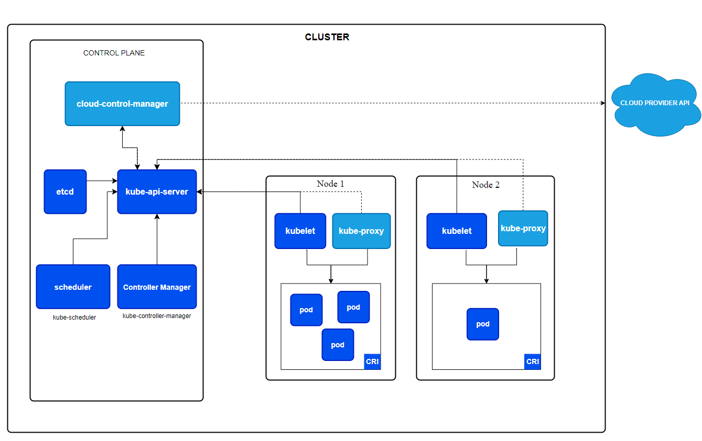

# Tài liệu Kubernetes YAML

## Kiến trúc tổng quan Kubernetes

Kubernetes gồm các thành phần chính:
- **Control Plane (Master):** Quản lý trạng thái cluster, lịch trình pod, điều phối tài nguyên.
    - `kube-apiserver`, `etcd`, `kube-scheduler`, `kube-controller-manager`.
- **Node (Worker):** Chạy các pod ứng dụng.
    - `kubelet`, `kube-proxy`, Container Runtime (Docker/containerd).
- **Add-ons:** DNS, dashboard, monitoring, ...

### Sơ đồ kiến trúc (minh họa)


---

Tài liệu này giải thích chi tiết về các file YAML trong thư mục `k8s/` của dự án, lý do cấu hình và vai trò của từng file.

## 1. `deployment.yml`
- **Chức năng:** Khai báo cấu hình cho Pod và ReplicaSet, định nghĩa số lượng bản sao (replica), image, biến môi trường, volume, port, liveness/readiness probe, v.v.
- **Tại sao cần:** Đảm bảo ứng dụng luôn sẵn sàng, tự động scale, tự phục hồi khi pod lỗi. Quản lý version image dễ dàng.
- **Ví dụ cấu hình:**
  - `replicas`: Số lượng pod chạy song song.
  - `containers.image`: Đường dẫn image docker.
  - `envFrom`: Lấy biến môi trường từ ConfigMap/Secret.
  - `resources`: Giới hạn CPU/RAM cho pod.

## 2. `service.yml`
- **Chức năng:** Định nghĩa Service để expose các Pod ra bên ngoài hoặc giữa các pod với nhau.
- **Tại sao cần:** Cho phép truy cập ứng dụng qua một địa chỉ IP/port ổn định, load balancing giữa các pod.
- **Ví dụ cấu hình:**
  - `type: ClusterIP/NodePort/LoadBalancer`: Kiểu service.
  - `selector`: Kết nối với pod dựa trên label.
  - `ports`: Định nghĩa port mapping.

## 3. `configmap.yml`
- **Chức năng:** Lưu trữ cấu hình không nhạy cảm (ví dụ: DB_HOST, APP_ENV, ...).
- **Tại sao cần:** Giúp tách biệt cấu hình khỏi code, dễ dàng thay đổi mà không cần build lại image.
- **Lưu ý:** Có thể commit file này lên git.

## 4. `secret.yml`
- **Chức năng:** Lưu trữ thông tin nhạy cảm (password, API key, ...), thường được mã hóa base64.
- **Tại sao cần:** Bảo mật thông tin nhạy cảm, inject vào pod qua biến môi trường hoặc volume.
- **Lưu ý:** Không nên commit file này với dữ liệu thật lên git. Chỉ dùng file mẫu hoặc placeholder.

---

# Giải thích cấu trúc thư mục k8s/

Thư mục `k8s/` được tổ chức thành các sub-folder để dễ quản lý và mở rộng:
- `app/`: Chứa các file YAML triển khai ứng dụng backend (deployment, service).
- `db/`: Chứa các file YAML triển khai database (Postgres), PVC cho lưu trữ dữ liệu.
- `cache/`: Chứa các file YAML triển khai Memcached (cache).
- `configmap.yml`, `secret.yml`: Quản lý cấu hình và thông tin nhạy cảm dùng chung cho các service.

**Lý do tổ chức như vậy:**
- Dễ bảo trì, mở rộng từng thành phần (app, db, cache) độc lập.
- Tách biệt cấu hình chung (configmap, secret) khỏi logic triển khai từng service.
- Dễ apply/xóa từng thành phần khi phát triển hoặc vận hành.

---

# Các bước chạy và lệnh triển khai

1. **Tạo ConfigMap và Secret**
   - Lưu cấu hình không nhạy cảm vào `configmap.yml`.
   - Lưu thông tin nhạy cảm vào `secret.yml` (hoặc `secret.example.yml` nếu chưa có thông tin thật).
   - Apply:
     ```bash
     kubectl apply -f k8s/configmap.yml
     kubectl apply -f k8s/secret.yml
     ```

2. **Triển khai Database (Postgres)**
   - Apply PVC, deployment và service cho Postgres:
     ```bash
     kubectl apply -f k8s/db/postgres-pvc.yaml
     kubectl apply -f k8s/db/postgres-deployment.yml
     kubectl apply -f k8s/db/postgres-service.yml
     ```

3. **Triển khai Cache (Memcached)**
   - Apply deployment và service cho Memcached:
     ```bash
     kubectl apply -f k8s/cache/cache-deployment.yml
     kubectl apply -f k8s/cache/cache-service.yml
     ```

4. **Triển khai Ứng dụng Backend**
   - Apply deployment và service cho backend:
     ```bash
     kubectl apply -f k8s/app/deployment.yml
     kubectl apply -f k8s/app/service.yml
     ```

5. **Kiểm tra trạng thái các resource**
   ```bash
   kubectl get pods
   kubectl get svc
   kubectl get deployment
   kubectl get configmap
   kubectl get secret
   ```

6. **Truy cập ứng dụng**
   - Dùng lệnh:
     ```bash
     minikube service tutorial-service
     ```
   - Hoặc port-forward:
     ```bash
     kubectl port-forward svc/tutorial-service 8080:80
     # Truy cập http://localhost:8080/healthz
     ```

7. **Xóa resource khi không cần thiết**
   ```bash
   kubectl delete -f k8s/<tên-file>.yml
   ```

---

# Lý do tạo các file YAML

- **Deployment**: Đảm bảo ứng dụng tự động scale, tự phục hồi khi pod lỗi, quản lý version image.
- **Service**: Expose pod ra ngoài, load balancing, truy cập ổn định qua 1 địa chỉ IP/port.
- **ConfigMap**: Tách biệt cấu hình khỏi code, dễ thay đổi mà không cần build lại image.
- **Secret**: Bảo mật thông tin nhạy cảm, inject vào pod qua biến môi trường hoặc volume.
- **PVC (PersistentVolumeClaim)**: Đảm bảo dữ liệu database không bị mất khi pod bị xóa hoặc restart.

---

# Minikube và Kubectl là gì? Vì sao cần cả hai?

## Minikube
- Minikube là công cụ giúp bạn tạo một cụm (cluster) Kubernetes thật trên máy cá nhân (Windows, Mac, Linux).
- Khi khởi động, Minikube sẽ tự động cài đặt và chạy các thành phần **control plane** (kube-apiserver, etcd, scheduler, controller-manager) và **worker node** (kubelet, kube-proxy, container runtime) trong một máy ảo hoặc container.
- Nhờ Minikube, bạn có môi trường Kubernetes thật để phát triển, test, học tập mà không cần cloud hay server thật.

## Kubectl
- Kubectl là công cụ dòng lệnh (CLI) để giao tiếp với Kubernetes cluster.
- Bạn dùng kubectl để apply, xóa, cập nhật các file YAML (deployment, service, ...), xem trạng thái pod, log, event, ...
- Kubectl không chạy cluster, nó chỉ gửi lệnh tới cluster (thông qua kube-apiserver).

## Mối liên hệ
- Minikube tạo và chạy cluster Kubernetes trên máy bạn.
- Kubectl là công cụ để bạn điều khiển, thao tác với cluster đó.
- Khi cài minikube, nó sẽ tự động cấu hình để kubectl có thể kết nối tới cluster minikube.

**Tóm lại:**
- Minikube = môi trường cluster Kubernetes thật trên máy bạn.
- Kubectl = công cụ để gửi lệnh, thao tác với cluster (dù là minikube, cloud, hay cluster thật).

---

# Control Plane và Worker Node

- **Control plane** là phần lõi của Kubernetes, gồm các thành phần như: kube-apiserver, etcd, scheduler, controller-manager. Control plane quản lý, điều phối, giám sát toàn bộ cluster.
- **Worker node** là nơi chạy các workload (pod, container) của bạn.
- Khi bạn apply các file YAML (deployment, service, ...), Kubernetes sẽ tạo ra các pod, service, ... trên worker node. Control plane sẽ tự động quản lý, điều phối các resource này.
- Khi dùng Minikube, control plane đã được khởi tạo sẵn, bạn chỉ cần tạo các resource (pod, service, ...) để chạy trên worker node.

---

# Tham khảo
- [Kubernetes Docs](https://kubernetes.io/docs/)
- [Best practices for managing Kubernetes secrets](https://kubernetes.io/docs/concepts/configuration/secret/)
